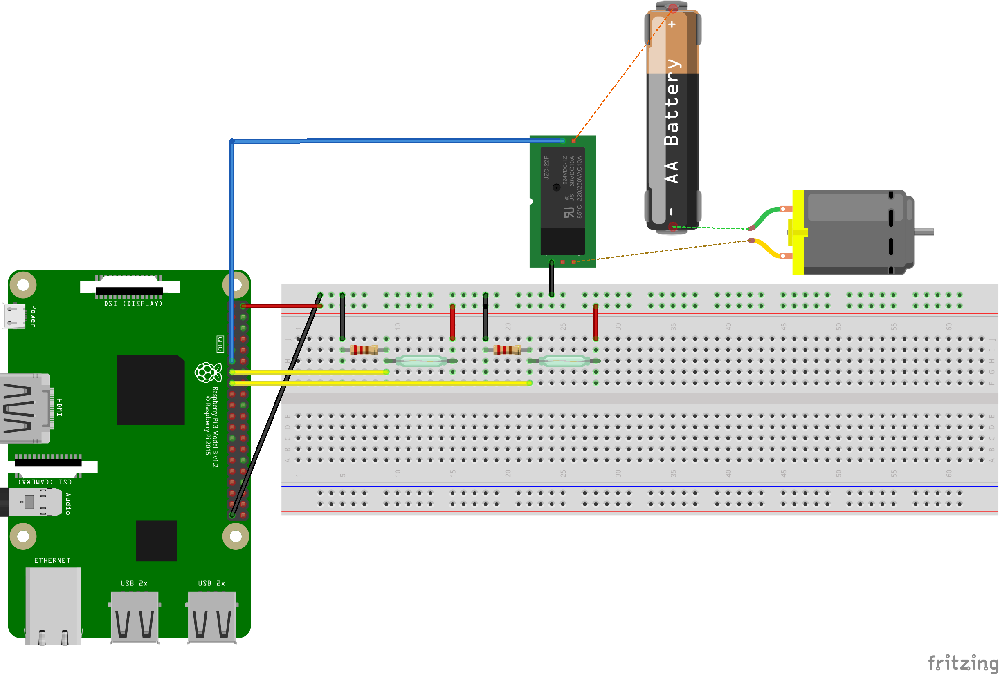

# Garage

## Problem

I need to remotely open my garage so my kids can take their bikes in and out and I don't want them losing my garage door opener.

## Solution

I'm going to wire a relay into the garage door opener and contorl it with a webserver.

## Design



## Issues

### Poetry hangs on install/add

There's something weird going on with Poetry and we need to disable keyrings to get it to not hang.

```bash
# https://github.com/python-poetry/poetry/issues/1917#issuecomment-1251667047
export PYTHON_KEYRING_BACKEND=keyring.backends.null.Keyring
python3 -m keyring --disable
```

### GPIO busy

```
lgpio.error: 'GPIO busy'
```

You can't run Flask in Debug mode with GPIO. At least not Buttons. Something to do with multithreading.